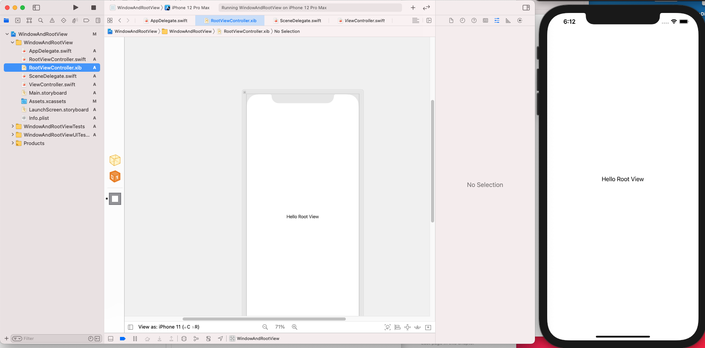

# Window and Root View Controller

### **Window Implementation:**
- **In iOS 12 and before**:

  If you create an app in Xcode 10 or before, the window is a property of AppDelegate class. This is an old Window Implementation.

- **In iOS 13 and later**

  If you create an app in Xcode 11 or before, the window is a property of SceneDelegate class. This is an new Window Implementation.


**How to new Window Implementation backs compatible in iOS 12 and before:**

1. In AppDelegate class
    - Declaring `window` property 
    - Adding `@available(iOS 13.0, *)` above the methods have  parameters relate to `UISceneSession` type. 
```swift
import UIKit

@main
class AppDelegate: UIResponder, UIApplicationDelegate {

    var window: UIWindow?

    func application(_ application: UIApplication, didFinishLaunchingWithOptions launchOptions: [UIApplication.LaunchOptionsKey: Any]?) -> Bool {
        return true
    }

    // MARK: UISceneSession Lifecycle

    @available(iOS 13.0, *)
    func application(_ application: UIApplication, configurationForConnecting connectingSceneSession: UISceneSession, options: UIScene.ConnectionOptions) -> UISceneConfiguration {
        return UISceneConfiguration(name: "Default Configuration", sessionRole: connectingSceneSession.role)
    }

    @available(iOS 13.0, *)
    func application(_ application: UIApplication, didDiscardSceneSessions sceneSessions: Set<UISceneSession>) {

    }


}
```
2. In the AppDelegate class, adding `@available(iOS 13.0, *)` above `SceneDelegate` class

```swift
import UIKit

@available(iOS 13.0, *)
class SceneDelegate: UIResponder, UIWindowSceneDelegate {

    var window: UIWindow?

// ...
}
```

---
### **UIWindow is a root layer:**

- When start an application, a window is created and displayed. 

  We need to create a view controller then assigning it to the window's rootViewController property
----
### **Developing App without a Story Board**

**Create a View Controller with XIB file**
1. File → New → File -> iOS → Source → Cocoa Touch Class -> Next
2. Naming `RootViewController` Choosing subclass of `UIViewController`, checking `"Also create XIB file"`.
3. In AppDelegate
```swift
    func application(_ application: UIApplication, didFinishLaunchingWithOptions launchOptions: [UIApplication.LaunchOptionsKey: Any]?) -> Bool {
        
        window = UIWindow()
        let rootVC = RootViewController()
        window?.rootViewController = rootVC
        window?.makeKeyAndVisible()
        
        return true
    }
```

4. In SceneDelegate
```swift
    func scene(_ scene: UIScene, willConnectTo session: UISceneSession, options connectionOptions: UIScene.ConnectionOptions) {
        guard let _ = (scene as? UIWindowScene) else { return }
        
        window = UIWindow(windowScene: scene as! UIWindowScene)
        let rootVC = RootViewController()
        window?.rootViewController = rootVC
        window?.makeKeyAndVisible()
    } 
```
5. Update view your XIB file then run
